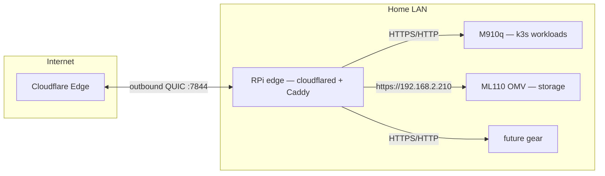

# Idea 04 — Dedicated Edge Device for Cloudflare Tunnel + Caddy

> Move the homelab's **public ingress** (`cloudflared` tunnel + Caddy reverse proxy)
> off the M910q and onto a dedicated low-power **edge box** (e.g. a cheap Raspberry Pi).
> One device owns all inbound routing for the LAN; backends (M910q, ML110 OMV, future
> gear) stay plain and cluster churn never drops external access.

**Status**: 🧠 Idea  
**Date**: 2026-08-09  
**Research**: none yet — see [Context](#context) and [Open Questions](#open-questions)  
**Issue**: [#65 — Dedicated edge device for Cloudflare Tunnel + Caddy ingress](https://github.com/jaroslaw-bagnicki/Homelab/issues/65)  

---

## Context

Today the homelab's external access lives on the **M910q**: `cloudflared` (`homelab-tunnel`)
runs in the Compose stack and Caddy is the reverse proxy (ADR 07, ADR 08 — V1 design).
Meanwhile:

- **ADR 22** is migrating homelab workloads to **k3s** on the M910q — cluster churn
  (upgrades, restarts, node maintenance) should not be able to drop the public tunnel.
- **ADR 23** scopes the ML110 OMV NAS as **storage-only** — no `cloudflared` on it. Its
  web UI (`omv.example.com`, runbook 22 §4d "Phase 2") still needs a tunnel path.
- **ADR 20** establishes Caddy as the **single routing layer** — a stable dedicated device
  strengthens "one Caddyfile is the only place to read routing".
- **ADR 08** still holds: home ISP is CGNAT; the edge box needs only a single **outbound**
  QUIC connection to Cloudflare's edge (UDP 7844). No inbound ports, no router config.
- **Cloudlab** (Contabo VPS) has its *own* tunnel + Caddy with a different DNS scope
  (ADR 19) — **out of scope** for this idea; it stays where it is.

## Goal

A dedicated, low-power edge device on the home LAN running `cloudflared` + Caddy as the
single ingress for the homelab:

Backends are reached over the LAN. The M910q, OMV, and anything new never need their own
`cloudflared`; they just serve plain HTTPS/HTTP to the edge.

## Benefits

1. **Ingress decoupled from compute** — k3s migration/reboots on the M910q never break
   the tunnel (the main reason, given ADR 22).
2. **OMV Phase 2 solved for free** — the edge routes to `https://192.168.2.210`; the NAS
   stays storage-only (ADR 23).
3. **Single routing layer, on a stable box** — extends ADR 20's "Caddyfile is the source
   of truth" to a dedicated device.
4. **Power & cost** — an RPi idles ~3–5 W; `cloudflared` + Caddy are Go/ARM64-native.
5. **CNAT/zero-config ingress unchanged** — the ADR 08 model still applies.

## Hardware options (TBD)

| Option | Pros | Cons |
|---|---|---|
| **Raspberry Pi 4/5** (or similar SBC) | Cheap (~€40–80), low power, well-supported ARM64, USB/SSD boot | Another device to manage; SD/USB storage reliability |
| **RPi Zero 2 W** | Cheapest (~€15–20), lowest power | Single USB port, 512 MB RAM, Wi-Fi-first (add USB Ethernet for stable LAN) |
| **Reuse the ML110** | Already owned, zero cost | Contradicts ADR 23 storage-only scope; high power (~80 W idle); overkill for a proxy |
| **Existing M910q (no change)** | No new hardware | Loses the decoupling benefit; ingress tied to cluster lifecycle |

## Considerations / Tradeoffs

- **New single point of failure** — the edge box becomes *the* ingress; if it dies,
  external access drops until replaced. Cheap to reflash/keep a spare; accept the risk.
- **Internal `.home` traffic (ADR 07)** — Caddy also serves internal domains; moving it
  means dnsmasq (ADR 06) must point `.home` at the edge box instead of the M910q.
- **Interaction with ADR 22's in-cluster ingress** — ADR 20/22 left *in-cluster* routing
  as a separate decision. A dedicated edge Caddy reshapes it: the cluster serves its own
  services internally, the edge owns public routing. Decide deliberately.
- **SSL mode vs OMV's self-signed cert** — `omv.example.com` via the edge: either CF SSL
  mode **Full** (accepts self-signed) or give OMV a Cloudflare **Origin CA** cert for
  **Full (Strict)** (the ADR 19 pattern). Protect the admin UI with **Cloudflare Access**.

## Open Questions

1. Which hardware? (SBC vs Zero 2 W vs reusing existing gear)
2. Replace `homelab-tunnel` + Caddy on the M910q entirely, or keep both in parallel
   during migration?
3. Where does the edge box sit on the TL-SG108E (runbook 23) and how does internal
   `.home` DNS get repointed (ADR 06)?
4. Does this ride along with the OMV "Phase 2" tunnel work (runbook 22 §4d)?
5. What happens to the M910q's V1 tunnel → standardize on the ADR 19/20 pattern as part
   of this move?

## Lifecycle

🧠 **Idea** → 📋 **Planned** (scoped + ADR in progress) → 🔨 **Implementing** → ✅ **Done**.
This is an architecture change that touches ADR 08/20/22 — expect a research doc → ADR
before implementation, not a drive-by move.

## References

- [ADR 07 — Reverse Proxy: Caddy with Auto-TLS](../decisions/07-reverse-proxy-caddy.md)
- [ADR 08 — Remote Access: Cloudflare Tunnel](../decisions/08-remote-access-cloudflare-tunnel.md)
- [ADR 19 — HTTPS-only origin via Cloudflare Tunnel (Cloudlab)](../decisions/19-cloudflare-tunnel-https-origin.md)
- [ADR 20 — Caddy as Single Routing Layer](../decisions/20-caddy-single-routing-layer.md)
- [ADR 22 — k3s + Azure Arc](../decisions/22-k3s-arc-homelab.md) — in-cluster ingress decision
- [ADR 23 — NAS on the ML110 (OMV)](../decisions/23-nas-on-ml110.md) — storage-only scope
- [Research 24 — network topology design](../research/24-network-topology-design.md)
- [Runbook 22 — ML110 OMV setup](../runbooks/22-ml110-omv-setup.md) — §4d "Phase 2" tunnel note
- [Runbook 23 — TL-SG108E switch](../runbooks/23-tl-sg108e-switch.md)
